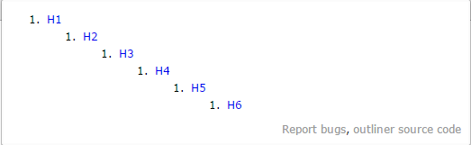
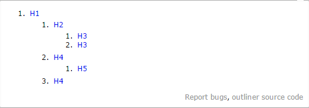

### modernizr

modernizr是一个基于MIT许可证书发布的开源JavaScript类库，用于检测浏览器是否支持HTML5及
CSS3特性

### HTML5大纲算法 （HTML5 Outliner）

大纲算法允许用户代理（user agent）从一个web页面生成一个信息结构目录，让用户对页面有一个
快速的概览。类似书籍、PDF、帮助文档等，都有一个清晰的目录结构，用户能方便的定位所需内容。
一个良好结构的大纲，不仅是对于搜索引擎的优化，更是为借助于屏幕阅读器浏览网页的盲人（或弱视力）用户提供了巨大的帮助。

#### 隐性节点

HTML4或之前，都采用h1~h6来生成大纲，每个标题（h1~h6）都会生成一个隐性节点
(implicit section),紧随其后的相对层级低的标题会成
为它的子节点，层级相同或者更高的标题则会关闭这个节点并生成新的节点。

结构

    <h1>H1</h1>
    <h2>H2</h2>
    <h3>H3</h3>
    <h4>H4</h4>
    <h5>H5</h5>
    <h6>H6</h6>

大纲

#### 显性节点

HTML5的新标签`<setion>`,`<article>`,`<aside>`,`<nav>`会生成显性节点（explicit sections），每个显性节点内部又有它自己的标题结构（也符合HTML4，HTML5大纲算法）。
*显性节点能包含隐性节点，反之则不行*

结构

    <h1>H1</h1>
    <article>
      <h2>H2</h2>
      <h3>H3</h3>
      <h3>H3</h3>
    </article>
    <article>
      <h4>H4</h4>
      <h5>H5</h5>
      <h4>H4</h4>
    </article>

大纲

#### 根节点

`<body>`,`<blockqupte>`,`
`,`<fieldset>`,`<figure>`,`<td>`为根节点，它们
可以拥有自己的大纲，但是它们的标题和节点对祖先的大纲没有任何影响（而且不会出现在祖先的
大纲里）。
